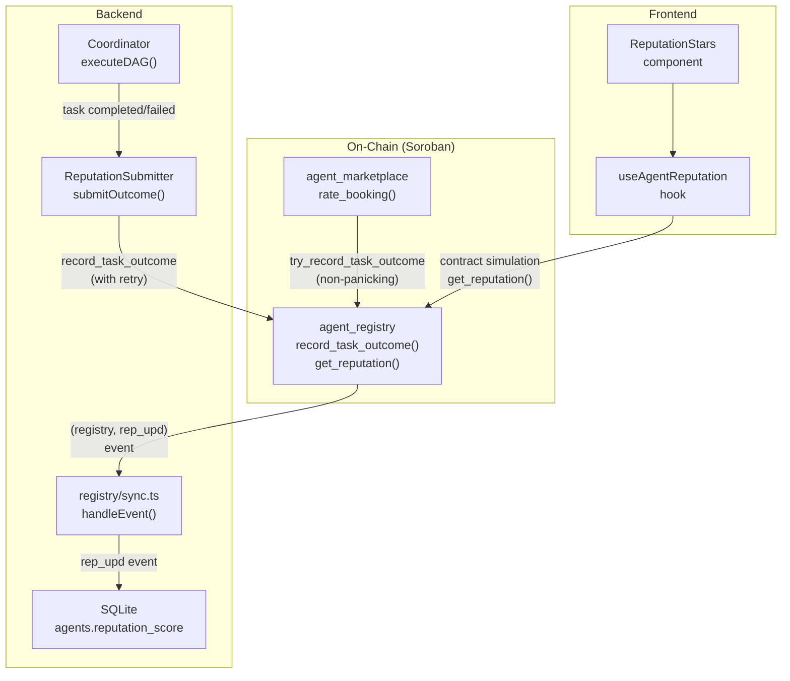
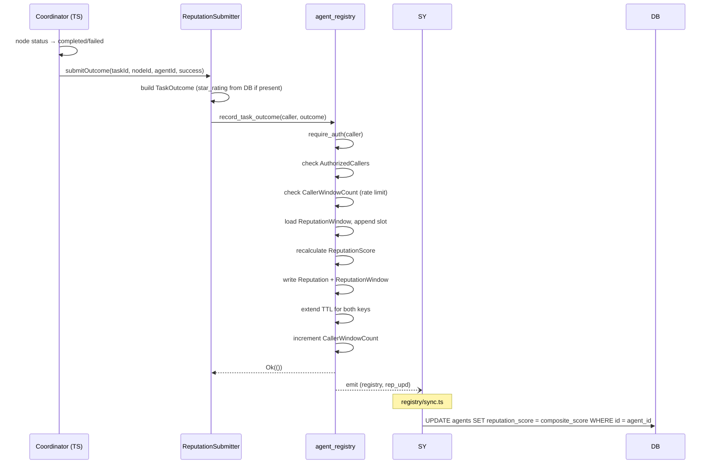
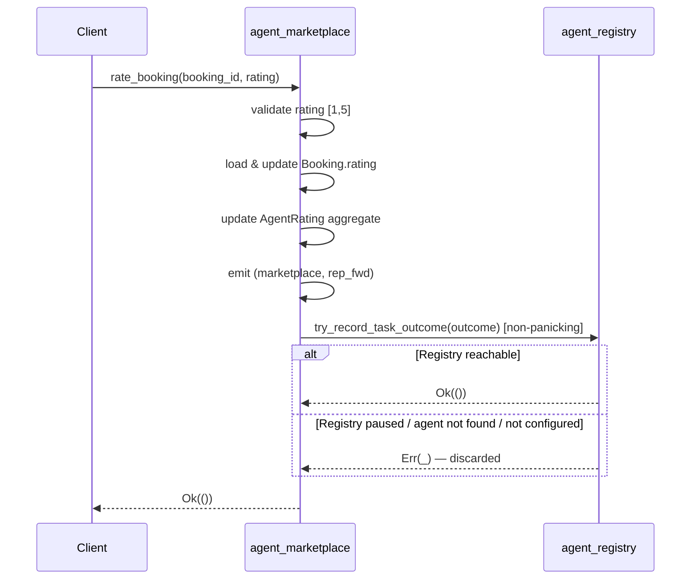
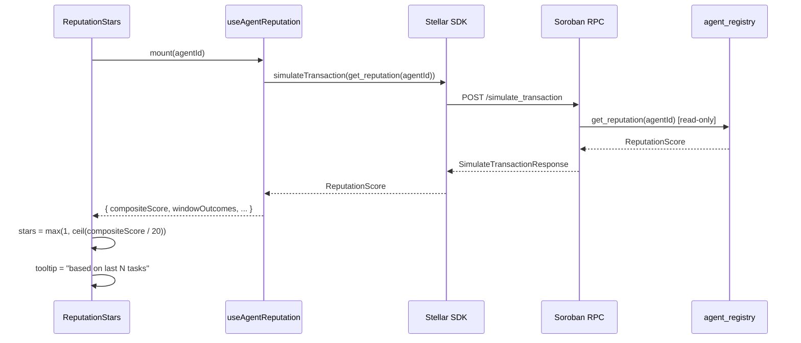

# Design Document: On-Chain Reputation Aggregation

## Overview

This feature replaces the current off-chain `reputation` field in `AgentRecord` with a first-class
`ReputationScore` stored directly in the `agent_registry` Soroban contract. Reputation is derived
from two signals — task success rate and marketplace star ratings — aggregated over a configurable
rolling window of the most recent N outcomes. Contributions are stake-weighted to dampen low-bond
flooding attacks. A single `get_reputation(agent_id)` call returns the full score; no off-chain
computation is required.

### Affected layers

| Layer | Component | Change type |
|---|---|---|
| Smart contract | `agent_registry` | New storage keys, new public functions, new error codes |
| Smart contract | `agent_marketplace` | Cross-contract forwarding from `rate_booking` |
| Backend | Coordinator | Post-completion hook submits `TaskOutcome` |
| Backend | Registry sync | `rep_upd` event handler updates SQLite |
| Frontend | `useAgentReputation` hook | Reads from contract instead of backend API |

---

## Architecture



### Key design decisions

1. **Integer-only arithmetic** — All weights and scores are stored as integers scaled by 100 to
   avoid floating-point. `weighted_avg_rating` is stored in units of 0.01 stars (range [100, 500]
   for 1–5 stars). Composite score stays in [0, 100].

2. **Fixed-size circular buffer** — `ReputationWindow` is a `Vec<OutcomeSlot>` of exactly
   `REPUTATION_WINDOW_SIZE` capacity, stored under `DataKey::ReputationWindow(agent_id)`. A
   `write_pos: u32` cursor advances modulo the window size on each write, providing O(1) insertion
   with bounded storage.

3. **Non-blocking marketplace forwarding** — `rate_booking` uses `try_invoke` so a paused or
   misconfigured registry never blocks a marketplace transaction.

4. **Temporary storage for rate-limit counters** — `CallerWindowCount` uses `Temporary` storage
   keyed by `(agent_id, caller)`, which auto-expires when the ledger TTL elapses rather than
   requiring explicit cleanup.

5. **AuthorizedCallers in Instance storage** — The allowlist is a `Vec<Address>` in `Instance`
   storage. It is a bounded, slow-changing set (coordinator keypairs); using `Instance` avoids
   per-key TTL management.

---

## Components and Interfaces

### agent_registry — new public functions

```rust
// Record a single task outcome. caller must be in AuthorizedCallers.
pub fn record_task_outcome(
    env: Env,
    caller: Address,
    outcome: TaskOutcome,
) -> Result<(), Error>

// Batch variant — validates all items then writes atomically (register_agents pattern).
pub fn record_task_outcomes(
    env: Env,
    caller: Address,
    outcomes: Vec<TaskOutcome>,
) -> Result<Vec<VoidBatchResult>, Error>

// Read the full ReputationScore for an agent.
pub fn get_reputation(env: Env, agent_id: Symbol) -> ReputationScore

// Read only the composite score (lightweight; used by discover_agents).
pub fn get_composite_score(env: Env, agent_id: Symbol) -> u32

// Returns the current configured window size constant.
pub fn get_reputation_window_size(env: Env) -> u32

// Admin: add / remove an authorized outcome submitter.
pub fn add_authorized_caller(env: Env, caller: Address) -> Result<(), Error>
pub fn remove_authorized_caller(env: Env, caller: Address) -> Result<(), Error>

// Off-chain check — no admin auth required.
pub fn is_authorized_caller(env: Env, caller: Address) -> bool

// Admin: update window size and score weights atomically.
pub fn set_reputation_config(
    env: Env,
    window_size: u32,
    success_weight: u32,
    rating_weight: u32,
) -> Result<(), Error>
```

### agent_marketplace — modified function

```rust
// Existing function — add cross-contract forwarding after local write.
pub fn rate_booking(env: Env, booking_id: Symbol, rating: u32) -> Result<(), Error>
```

### Backend — new ReputationSubmitter service

```typescript
// backend/src/services/reputationSubmitter.ts
export class ReputationSubmitter {
  constructor(
    contractId: string,
    signerKeypair: Keypair,
    db: Database.Database,
    options?: { maxRetries?: number; backoffBaseMs?: number }
  )
  async submitOutcome(taskId: string, nodeId: string, agentId: string, success: boolean): Promise<void>
}
```

### Frontend — updated hook

```typescript
// frontend/src/hooks/useAgentReputation.ts
// Replaces backend API call with Stellar SDK contract simulation
export function useAgentReputation(agentId: string): {
  data: OnChainReputationScore | null;
  loading: boolean;
  error: string | null;
}
```

---

## Data Models

### New contract types (agent_registry)

```rust
/// Per-agent rolling window stored in Persistent storage.
/// Capacity is always exactly REPUTATION_WINDOW_SIZE slots;
/// unwritten slots have success = false, star_rating = 0, rating_weight = 0.
#[contracttype]
pub struct ReputationWindow {
    pub slots: Vec<OutcomeSlot>,    // fixed size: REPUTATION_WINDOW_SIZE
    pub write_pos: u32,             // next write position (mod window_size)
    pub filled: u32,                // how many slots have real data (≤ window_size)
}

/// One slot in the circular buffer.
#[contracttype]
pub struct OutcomeSlot {
    pub success: bool,
    pub star_rating: u32,       // 0 = no rating, 1–5 = star rating
    pub rating_weight: u32,     // scaled by 100: 10..=100 (maps to 0.10..=1.00)
    pub caller: Address,
    pub ledger_timestamp: u64,
}

/// The aggregated on-chain reputation score per agent.
#[contracttype]
pub struct ReputationScore {
    pub agent_id: Symbol,
    pub composite_score: u32,       // [0, 100]
    pub success_rate: u32,          // [0, 100], percentage
    pub weighted_avg_rating: u32,   // [0, 500], scaled by 100 (e.g. 425 = 4.25 stars)
    pub total_outcomes: u64,        // all-time count
    pub window_outcomes: u64,       // count in current window
    pub last_updated: u64,          // ledger timestamp
}

/// Single task outcome submitted by an authorized caller.
#[contracttype]
pub struct TaskOutcome {
    pub agent_id: Symbol,
    pub success: bool,
    pub response_time_ms: u32,
    pub earnings_stroops: i128,
    pub star_rating: Option<u32>,   // None or Some(1..=5)
}

/// Emitted on every successful record_task_outcome call.
#[contracttype]
pub struct ReputationUpdatedEvent {
    pub agent_id: Symbol,
    pub composite_score: u32,
    pub success_rate: u32,
    pub total_outcomes: u64,
    pub window_outcomes: u64,
}

/// Admin-configurable reputation parameters (Instance storage).
#[contracttype]
pub struct ReputationConfig {
    pub window_size: u32,       // [10, 500], default 100
    pub success_weight: u32,    // [0, 100], default 60; must sum to 100 with rating_weight
    pub rating_weight: u32,     // [0, 100], default 40
}
```

### New DataKey variants (agent_registry)

```rust
pub enum DataKey {
    // ... existing keys ...

    /// Full ReputationScore per agent — Persistent storage, TTL-extended on every access.
    Reputation(Symbol),

    /// Circular buffer of recent outcomes — Persistent storage.
    ReputationWindow(Symbol),

    /// Authorized caller allowlist — Instance storage (bounded Vec<Address>).
    AuthorizedCallers,

    /// Reputation config (window size, score weights) — Instance storage.
    ReputationConfig,

    /// Temporary rate-limit counter: number of outcomes this window for (agent, caller).
    /// Temporary storage; auto-expires, no explicit cleanup needed.
    CallerWindowCount(Symbol, Address),
}
```

### New error codes (agent_registry)

```rust
pub enum Error {
    // ... existing 1–26 ...
    InvalidRating = 27,
    RateLimitExceeded = 28,
    InvalidConfig = 29,
}
```

### New marketplace DataKey variant

```rust
pub enum DataKey {
    // ... existing keys ...

    /// Registry contract address for cross-contract calls — Instance storage.
    RegistryAddress,
}
```

### Backend TypeScript types

```typescript
// Mirrors the on-chain ReputationScore struct
export interface OnChainReputationScore {
  agentId: string;
  compositeScore: number;      // [0, 100]
  successRate: number;         // [0, 100]
  weightedAvgRating: number;   // [0, 500], divide by 100 for display
  totalOutcomes: bigint;
  windowOutcomes: bigint;
  lastUpdated: bigint;
}

// rep_upd event payload
export interface ReputationUpdatedPayload {
  agent_id: string;
  composite_score: number;
  success_rate: number;
  total_outcomes: bigint;
  window_outcomes: bigint;
}
```

---

## Storage Layout

| Key | Storage type | Lifecycle | Description |
|---|---|---|---|
| `DataKey::Reputation(agent_id)` | Persistent | TTL extended on read/write | Full `ReputationScore` per agent |
| `DataKey::ReputationWindow(agent_id)` | Persistent | TTL extended on read/write | `ReputationWindow` circular buffer |
| `DataKey::AuthorizedCallers` | Instance | Singleton | `Vec<Address>` of approved submitters |
| `DataKey::ReputationConfig` | Instance | Singleton | `ReputationConfig` (window size, weights) |
| `DataKey::CallerWindowCount(agent_id, caller)` | Temporary | Auto-expires | Rate-limit counter per (agent, caller) pair |

### Score calculation (integer math)

```
// All intermediate values scaled × 100 to avoid floats.
// success_rate is in [0, 100].
// weighted_avg_rating is in [0, 500] (i.e. 1.00–5.00 stars scaled × 100).

// Normalize rating to [0, 100] scale: multiply by 20.
rating_normalized = (weighted_avg_rating * 20) / 100   // [0, 100]

// Weighted composite (using integer weights that sum to 100):
composite = (success_weight * success_rate + rating_weight * rating_normalized) / 100

// Clamp:
composite_score = min(max(composite, 0), 100)
```

### Weight derivation per slot

```
// MAX_WEIGHT_BOND = 1_000_000_000 stroops (100 XLM)
// MIN_RATING_WEIGHT = 10 (represents 0.10 on a 0–100 scale)

weight = if caller_bond == 0 {
    MIN_RATING_WEIGHT
} else {
    min(caller_bond_stroops, MAX_WEIGHT_BOND) * 100 / MAX_WEIGHT_BOND
}
// weight is in [10, 100]
```

---

## Sequence Diagrams

### Task completion → on-chain reputation update



### marketplace.rate_booking → cross-contract forwarding



### Frontend on-chain read



---

## Error Handling

### Contract errors

| Error | Code | Trigger | Behavior |
|---|---|---|---|
| `Error::Unauthorized` | 2 | `record_task_outcome` by non-allowlisted caller | Return error, no state change |
| `Error::ContractPaused` | 4 | Any mutation while paused | Return error, no state change |
| `Error::NotFound` | 1 | `record_task_outcome` for unregistered agent | Return error, no state change |
| `Error::InvalidRating` | 27 | `star_rating` outside [1, 5] | Return error, no state change |
| `Error::RateLimitExceeded` | 28 | Caller exceeds 10 outcomes/window for one agent | Return error, no state change |
| `Error::InvalidConfig` | 29 | `window_size` outside [10, 500], or weights not summing to 100 | Return error, no state change |

### Batch atomicity

`record_task_outcomes` follows the `register_agents` validation-first pattern:

1. Validate every `TaskOutcome` in a first pass (auth already called once, per the batch auth note in lib.rs).
2. Collect per-item `VoidBatchResult` (Ok or Err code).
3. If any item has an error, return early — no writes occur.
4. Write all outcomes atomically in a second pass.

### Backend submitter errors

| Error class | Retry behaviour |
|---|---|
| Network timeout / `tx_too_late` / `TOO_MANY_REQUESTS` | Exponential backoff, up to 3 attempts |
| `Error::NotFound` (agent deregistered) | Log ERROR, no retry |
| `Error::Unauthorized` (key not in allowlist) | Log ERROR, no retry — operator action needed |
| `Error::RateLimitExceeded` | Log WARN, no retry — discard outcome |
| All other on-chain errors | Log ERROR, no retry |

### Frontend

- On RPC failure or missing data, `useAgentReputation` returns `error` string and `data: null`.
- `ReputationStars` renders grey placeholder stars when `data` is null.
- A skeleton loader is shown while `loading` is true.

---

## Testing Strategy

### Dual testing approach

Both unit tests and property-based tests are required. Unit tests cover specific examples and error
conditions; property tests verify universal correctness across randomly generated inputs.

### Property-based testing configuration

- Library: **proptest** (Rust, for contract logic) and **fast-check** (TypeScript, for backend/frontend).
- Each property test runs a **minimum of 100 iterations**.
- Each test is tagged with a comment referencing the design property it validates.
- Format: `// Feature: on-chain-reputation, Property N: <property_text>`

### Contract unit tests (Rust, Soroban test env)

Located in `smart-contracts/contracts/agent_registry/src/test.rs` and a new
`smart-contracts/contracts/agent_registry/src/reputation_tests.rs`.

- Example: default score returned for agent with no outcomes (Property 2)
- Example: `rep_upd` event emitted on successful outcome recording (Property 7.1)
- Example: `auth_add` / `auth_rem` events on allowlist mutations (Requirement 3.5)
- Example: `discover_agents` reads composite_score after update (Requirement 6.3)
- Edge case: paused contract rejects `record_task_outcome` (Requirement 2.3)
- Edge case: cross-contract forwarding failure does not block `rate_booking` (Requirement 8.3)
- Edge case: zero-bond caller receives MIN_RATING_WEIGHT (Requirement 5.2)

### Contract property tests (proptest)

```rust
// Feature: on-chain-reputation, Property 1: Reputation score round-trip
proptest! {
    fn prop_reputation_score_round_trip(outcomes in vec(arb_task_outcome(), 1..=50)) { ... }
}

// Feature: on-chain-reputation, Property 3: Unauthorized callers are rejected
proptest! {
    fn prop_unauthorized_caller_rejected(caller in arb_address()) { ... }
}

// Feature: on-chain-reputation, Property 8: Rolling window is bounded
proptest! {
    fn prop_rolling_window_bounded(n in (WINDOW_SIZE + 1)..=(WINDOW_SIZE * 3)) { ... }
}

// Feature: on-chain-reputation, Property 11: Rating weight formula
proptest! {
    fn prop_rating_weight_formula(bond in 0_i128..=2_000_000_000_i128) { ... }
}

// Feature: on-chain-reputation, Property 12: Composite score formula and clamp
proptest! {
    fn prop_composite_score_formula_and_clamp(outcomes in vec(arb_outcome_with_rating(), 1..=100)) { ... }
}
```

### Backend unit tests (TypeScript / Jest)

Located in `backend/src/services/reputationSubmitter.test.ts`.

- Example: `submitOutcome` calls `record_task_outcome` after task completion (Requirement 9.1)
- Example: `rep_upd` event handler updates `agents.reputation_score` in SQLite (Requirement 7.4)
- Property: retry on retryable errors, up to 3 attempts (Property 15)
- Property: `star_rating` is only included when `client_rating` is non-null (Property 16)

### Frontend unit tests (TypeScript / Vitest)

Located in `frontend/src/hooks/useAgentReputation.test.ts`.

- Example: hook calls contract simulation, not backend API (Requirement 10.1)
- Example: on RPC failure, data is null and placeholder renders (Requirement 10.4)
- Property: star mapping formula `ceil(composite_score / 20)` clamped to [1, 5] (Property 17)
- Property: tooltip text includes `window_outcomes` count (Property 18)

---

## Correctness Properties

*A property is a characteristic or behavior that should hold true across all valid executions of a
system — essentially, a formal statement about what the system should do. Properties serve as the
bridge between human-readable specifications and machine-verifiable correctness guarantees.*

### Property 1: Reputation score round-trip

*For any* sequence of valid `TaskOutcome` values recorded for a registered agent, calling
`get_reputation(agent_id)` after the writes must return a `ReputationScore` whose `agent_id`
matches, `composite_score` is in [0, 100], `success_rate` is in [0, 100],
`weighted_avg_rating` is in [0, 500], and `total_outcomes` equals the cumulative count of all
submitted outcomes.

**Validates: Requirements 1.1, 1.2, 1.3**

---

### Property 2: Default score for agent with no outcomes (example)

*For the specific case* of calling `get_reputation` on an agent that has never had an outcome
recorded, the returned `ReputationScore` must have `composite_score = 50`, `success_rate = 0`,
`weighted_avg_rating = 0`, `total_outcomes = 0`, and `window_outcomes = 0`.

**Validates: Requirement 1.4**

---

### Property 3: Unauthorized callers are rejected

*For any* `Address` that has not been added to `AuthorizedCallers`, calling `record_task_outcome`
with that address must return `Error::Unauthorized` and leave all `Reputation` and
`ReputationWindow` storage entries unchanged.

**Validates: Requirements 2.2, 3.4**

---

### Property 4: Authorized caller add/remove round-trip

*For any* `Address`, after calling `add_authorized_caller`, `is_authorized_caller` must return
`true`; after subsequently calling `remove_authorized_caller` for the same address,
`is_authorized_caller` must return `false`. The inverse sequence (remove then add) must also
produce a consistent final state.

**Validates: Requirements 3.2, 3.3**

---

### Property 5: Invalid star rating is rejected

*For any* integer value outside the range [1, 5] passed as `star_rating` in a `TaskOutcome`,
`record_task_outcome` must return `Error::InvalidRating` without modifying any stored
`ReputationScore` or `ReputationWindow`.

**Validates: Requirement 2.6**

---

### Property 6: Unknown agent returns NotFound

*For any* `agent_id` symbol that does not correspond to an existing `AgentRecord` in the registry,
calling `record_task_outcome` must return `Error::NotFound` and produce no state changes.

**Validates: Requirement 2.4**

---

### Property 7: Batch is atomic — one invalid entry prevents all writes

*For any* batch of `TaskOutcome` values containing at least one entry that would individually fail
validation (invalid rating, unknown agent, or rate-limited caller), calling
`record_task_outcomes` must return a result containing at least one `VoidBatchResult::Err` and
leave every `ReputationScore` in the registry unchanged from its pre-call state.

**Validates: Requirement 2.8**

---

### Property 8: Rolling window size is bounded

*For any* agent and *for any* number N of outcomes recorded where N > `REPUTATION_WINDOW_SIZE`,
the number of slots in `ReputationWindow.slots` must always equal exactly `REPUTATION_WINDOW_SIZE`.
Furthermore, after the (REPUTATION_WINDOW_SIZE + 1)-th outcome is recorded, the outcome at the
slot that was first written (write_pos = 0) must have been overwritten with the newest data,
confirming FIFO eviction.

**Validates: Requirements 4.1, 4.2**

---

### Property 9: Window config validates bounds

*For any* `window_size` value outside [10, 500] passed to `set_reputation_config`, the call must
return `Error::InvalidConfig`. *For any* pair `(success_weight, rating_weight)` where their sum
does not equal 100, the call must also return `Error::InvalidConfig`. For values within valid
ranges, the call must succeed and subsequent `get_reputation_window_size()` calls must reflect the
new value.

**Validates: Requirements 4.5, 6.5**

---

### Property 10: Per-caller rate limit is enforced

*For any* caller that has submitted exactly `MAX_OUTCOMES_PER_CALLER_PER_WINDOW` (= 10) outcomes
for a given agent within the active window, the next submission attempt for that same (agent,
caller) pair must return `Error::RateLimitExceeded` without modifying state.

**Validates: Requirement 5.5**

---

### Property 11: Rating weight formula is correct

*For any* caller bond amount `b` in stroops, the computed `rating_weight` stored in an
`OutcomeSlot` must equal `min(b, MAX_WEIGHT_BOND) * 100 / MAX_WEIGHT_BOND`, clamped to a minimum
of `MIN_RATING_WEIGHT` (10) when `b == 0`. Furthermore, *for any* set of window slots each with
known `star_rating_i` and `rating_weight_i`, the stored `weighted_avg_rating` must equal
`(Σ star_rating_i * rating_weight_i) * 100 / Σ rating_weight_i`, using only slots where
`star_rating > 0`.

**Validates: Requirements 5.1, 5.2, 5.3**

---

### Property 12: Composite score formula is correct and always clamped

*For any* `ReputationScore` with known `success_rate` and `weighted_avg_rating`, the stored
`composite_score` must equal `clamp(round(success_weight * success_rate / 100 + rating_weight * weighted_avg_rating * 20 / 10000), 0, 100)`.
This must hold for the default weights (60/40) and for any custom weights where
`success_weight + rating_weight == 100`. The value must never be less than 0 or greater than 100.

**Validates: Requirements 6.1, 6.2**

---

### Property 13: One rep_upd event emitted per batch item

*For any* batch of N valid `TaskOutcome` values passed to `record_task_outcomes`, exactly N
`(registry, rep_upd)` events must be emitted — one per outcome — each carrying the correct
`agent_id` and the updated `composite_score` for that agent.

**Validates: Requirement 7.3**

---

### Property 14: Retry submitter behaviour (backend)

*For any* sequence of retryable errors followed eventually by success within 3 total attempts,
`ReputationSubmitter.submitOutcome` must eventually resolve successfully without throwing. *For any*
sequence of 3 or more consecutive retryable errors, the submitter must reject after exactly 3
attempts. *For any* non-retryable error (`NotFound`, `Unauthorized`) on any attempt, the submitter
must reject immediately without further retries.

**Validates: Requirements 9.3, 9.4**

---

### Property 15: star_rating is included iff client_rating is present (backend)

*For any* task record in SQLite, if `client_rating` is `NULL`, the `TaskOutcome` constructed by
`ReputationSubmitter` must have `star_rating: None`. If `client_rating` is a non-null integer in
[1, 5], `star_rating` must be `Some(client_rating)`.

**Validates: Requirement 9.5**

---

### Property 16: Star display mapping is correct (frontend)

*For any* `composite_score` value in [0, 100], the number of stars displayed by `ReputationStars`
must equal `max(1, min(5, Math.ceil(composite_score / 20)))`. The result must always be an integer
in [1, 5].

**Validates: Requirement 10.3**

---

### Property 17: Tooltip reflects window_outcomes count (frontend)

*For any* `ReputationScore` with `window_outcomes = N`, the tooltip text rendered by
`ReputationStars` must contain the string representation of N (e.g. "based on last N tasks").

**Validates: Requirement 10.5**
