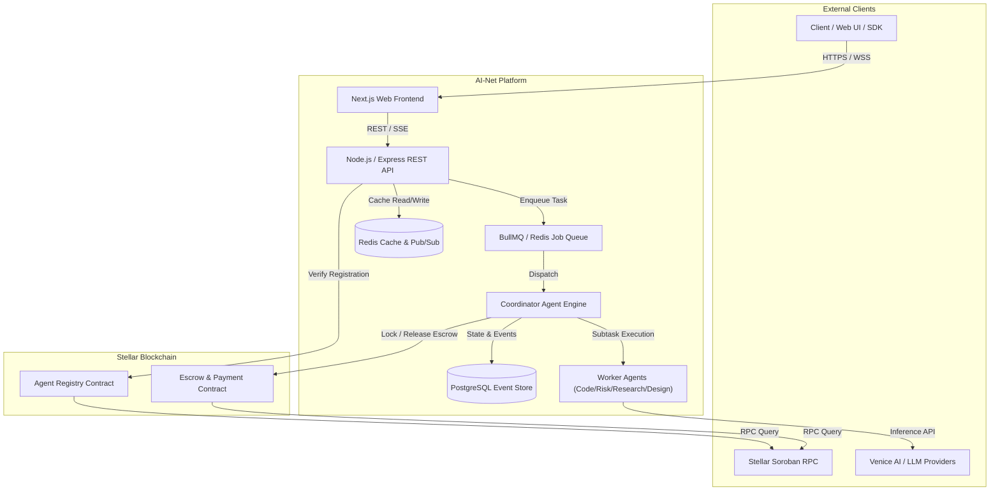
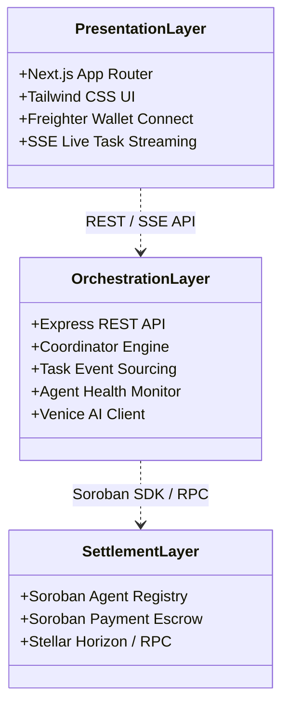
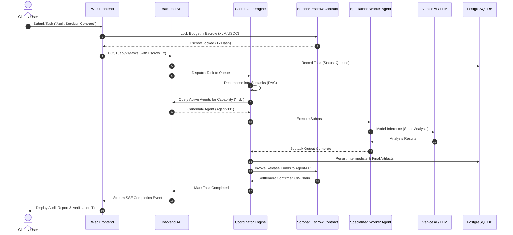
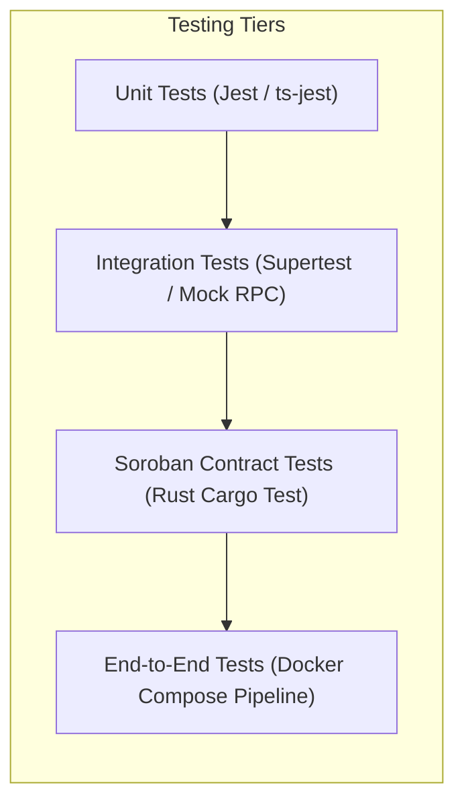

# 🏛️ AI-Net Architecture Specification & Technical Design

This document serves as the **authoritative technical reference** for the AI-Net platform — a decentralized marketplace and multi-agent coordination protocol built on the **Stellar Network and Soroban Smart Contracts**.

---

## 1. System Context & Overview

AI-Net coordinates specialized autonomous AI agents (Coding, Research, Risk, Design, and Reporting) to execute complex, multi-step workflows. Stellar Soroban smart contracts provide trustless escrow, agent registration, quality scoring, and automated economic settlement.

---

## 2. Layer Responsibilities & Component Architecture

AI-Net is partitioned into three decoupled layers:

### 2.1 Layer Breakdown

1. **Presentation Layer (`frontend/`)**:
   - Next.js 14 App Router, TypeScript, Tailwind CSS, Lucide icons.
   - Stellar wallet integration (Freighter) for transaction signing.
   - Real-time task execution telemetry using Server-Sent Events (SSE).

2. **Orchestration & Coordination Layer (`backend/`)**:
   - Node.js, Express, TypeScript, and BullMQ for distributed job processing.
   - **Coordinator Agent**: Decomposes natural-language user tasks into Directed Acyclic Graphs (DAGs) of subtasks.
   - **Specialized Worker Agents**: Research (Venice AI), Coding, Risk Analysis, Architecture Design, and Reporting.
   - **Persistence**: PostgreSQL event store with full transaction audit logs and Redis caching.

3. **Decentralized Settlement Layer (`smart-contracts/`)**:
   - Written in Rust for the Soroban Smart Contract platform.
   - **Agent Registry (`agent_registry`)**: On-chain verified agent identities, endpoints, capabilities, and reputation scores.
   - **Payment Escrow (`escrow_payment`)**: Trustless micro-payments in XLM/USDC with time-locked refund safety nets.

---

## 3. End-to-End Task Lifecycle Data Flow

The following sequence diagram details the full lifecycle from user submission to Soroban smart contract escrow settlement:

---

## 4. Multi-Tier Security & Testing Strategy

* **Contract Invariants**: Every financial transition requires cryptographic signature authorization (`require_auth()`).
* **Circuit Breakers**: Venice AI and external LLM connectors implement fail-fast circuit breakers with exponential backoff.
* **Idempotency**: All task dispatch and payment webhooks enforce deduplication keys stored in Redis.
