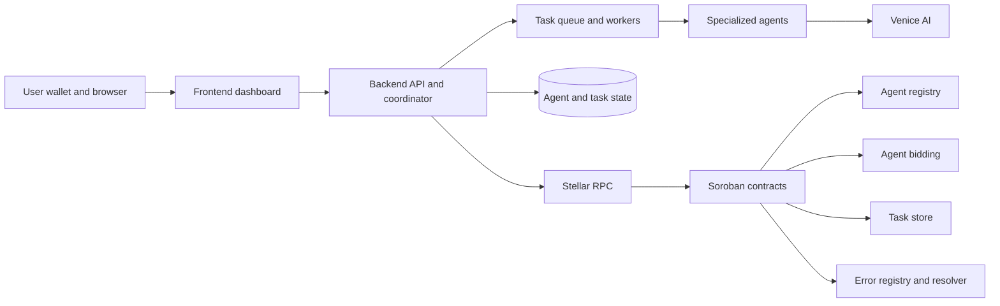
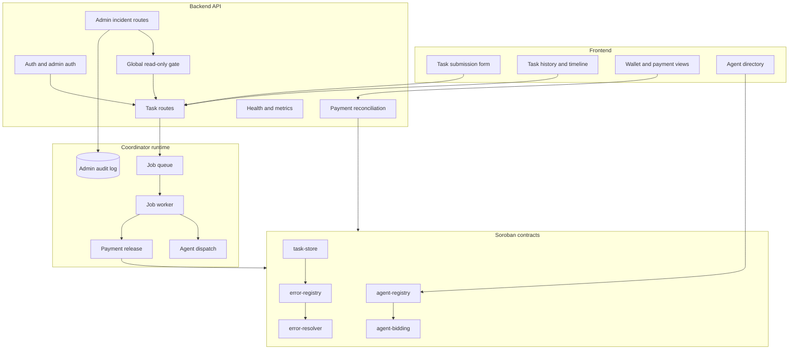
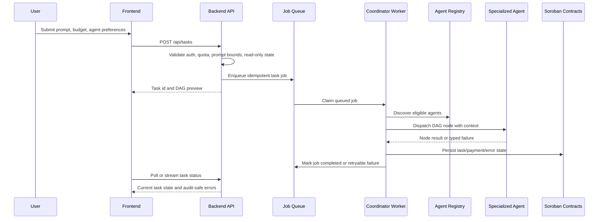
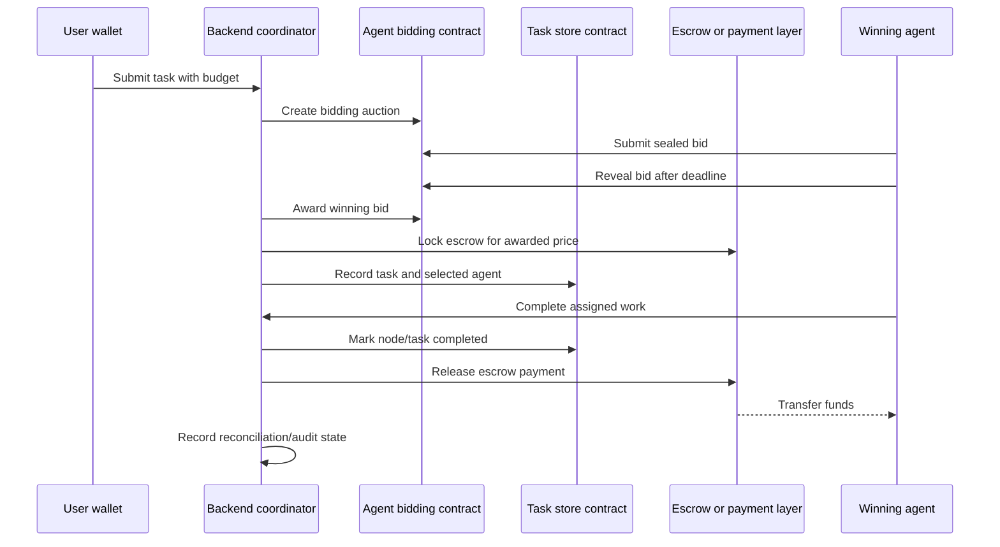

# ai-net Architecture

This is the authoritative technical map for ai-net. It describes how the frontend, backend coordinator, and Stellar smart contracts fit together, how task state moves through the system, and where tests should cover each layer.

## System Context

ai-net has three primary layers:

| Layer | Responsibility | Primary source |
|---|---|---|
| Frontend | Task submission, task history, wallet flows, agent browsing, status/error surfaces | `frontend/src` |
| Backend | API auth, rate limits, read-only incident controls, task orchestration, queue workers, reconciliation, audit logging | `backend/src` |
| Smart contracts | Agent identity, bidding, task records, error metadata, upgrade-controlled on-chain state | `smart-contracts/contracts` |

## Component Model

## Task Lifecycle

Task state is authoritative in the backend queue/task database while execution is in flight. Contract records provide the durable on-chain settlement and registry truth. Reconciliation compares backend payment intent with observed Stellar state and repairs safe mismatches through explicit operator action.

## Payment And Escrow Flow

Every contract mutation must call `require_auth()` for the signer that owns the action. Singleton configuration such as admin and contract version belongs in instance storage. Entity records belong in persistent or temporary storage with TTL handling and bounded collection access.

## Incident Controls

Operators use `/api/admin/*` endpoints guarded by `ADMIN_API_KEY`.

| Control | Backend endpoint | Behavior |
|---|---|---|
| Global read-only | `PUT /api/admin/read-only` | Blocks `POST`, `PUT`, `PATCH`, and `DELETE` outside exempt admin/reconciliation paths |
| Agent enablement | `GET /api/admin/agents`, `POST /api/admin/agents/:id/enable`, `POST /api/admin/agents/:id/disable` | Lists or flips agent availability without manual database edits |
| Reconciliation | `POST /api/admin/reconciliation/run` | Runs payment reconciliation using the configured service |
| Maintenance | `POST /api/admin/maintenance/vacuum`, `POST /api/admin/maintenance/backup` | Runs SQLite vacuum or backup over operational databases |
| Audit export | `GET /api/admin/audit-log?format=json|csv` | Exports admin action history |

Every admin route is audit-logged after response completion with actor, route, status code, request id, redacted request body, and timestamp.

## Upgrade Model

The registry, bidding, task store, error resolver, and error registry contracts expose:

| Function | Purpose |
|---|---|
| `admin` | Returns the configured upgrade administrator |
| `contract_version` | Returns the active semantic contract version |
| `upgrade(new_wasm_hash, new_version)` | Requires admin auth, updates current contract WASM, stores the new version, and emits an upgrade event |

Deployment manifests in `smart-contracts/deployments/*.json.template` record contract ids, wasm hashes, versions, admins, and the verified upgrade script path. The live verification entry point is `smart-contracts/scripts/verified-upgrade-sequence.sh`; mainnet manifests require a testnet verification run before production upgrade execution.

## Layer Responsibilities

| Area | Frontend | Backend | Contracts |
|---|---|---|---|
| Identity | Shows wallet and agent identity | Authenticates users/admins/agents | Authorizes on-chain actors with `require_auth()` |
| Task state | Displays DAG preview, status, errors | Owns queue state and idempotent execution | Stores durable task facts where required |
| Agent selection | Captures preferences and shows registry data | Filters/ranks agents and dispatches work | Stores agent capabilities, fees, bonds, status |
| Payments | Presents balances and settlement status | Creates release intents and reconciles | Enforces escrow and payment mutations |
| Incidents | Shows graceful errors | Read-only toggle, maintenance, audit export | Admin-guarded upgrade and pause-style controls |
| Observability | Loading, empty, and error states | Metrics, logs, health, admin audit | Events for indexers and settlement review |

## Test Map

| Test layer | What it should prove |
|---|---|
| Smart contract unit tests | Auth is required for mutations, upgrade methods expose admin/version, storage remains bounded, task/bidding/error flows preserve invariants |
| Smart contract integration/e2e | Verified upgrade sequence runs on testnet against registry, bidding, task store, error resolver, and error registry |
| Backend unit tests | Read-only blocks mutations, admin actions audit-log, reconciliation can be triggered safely, agent enable/disable is idempotent |
| Backend integration tests | Queue/task lifecycle survives retries and emits stable API responses |
| Frontend tests | Components consume semantic tokens, render loading/error states, and preserve task/wallet workflows across themes |
