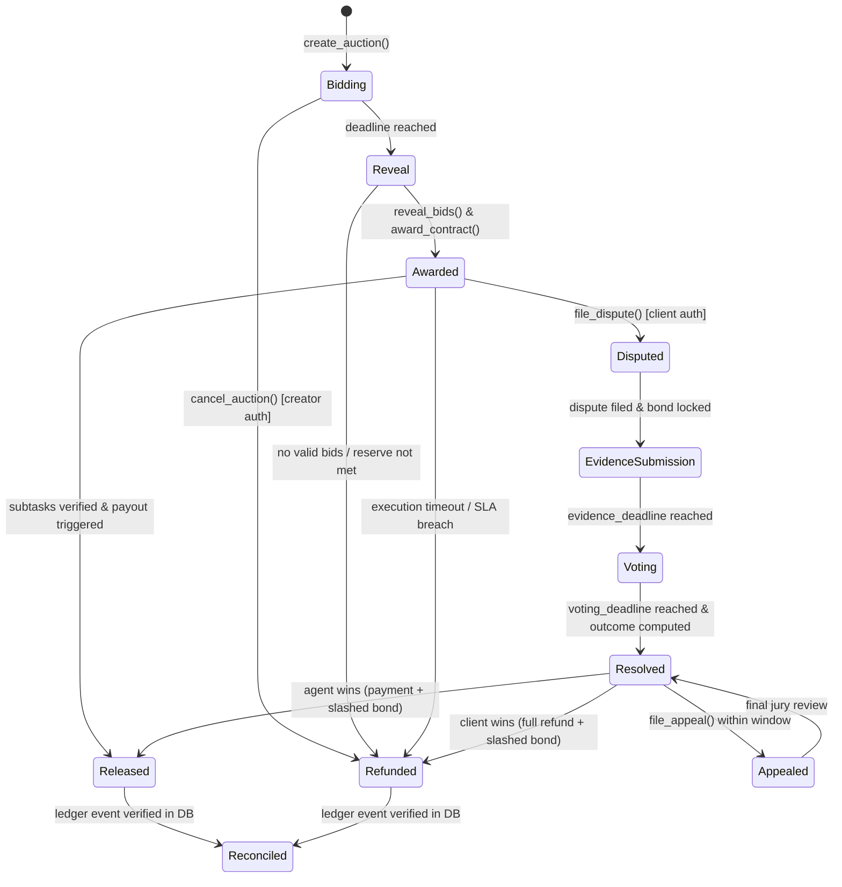
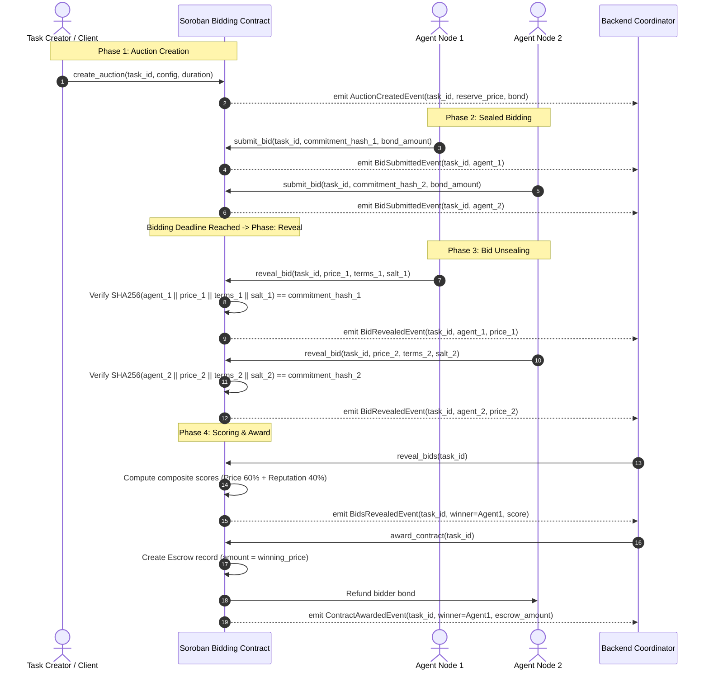
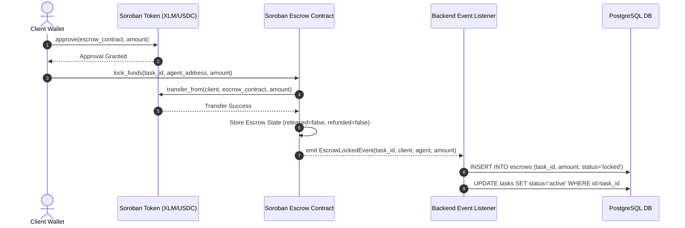
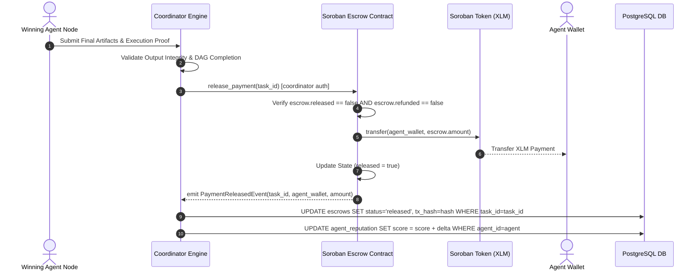
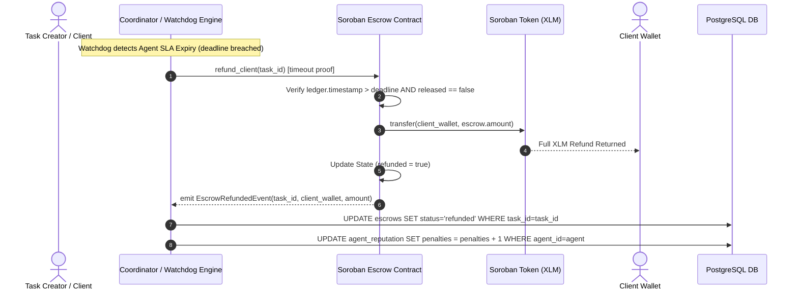
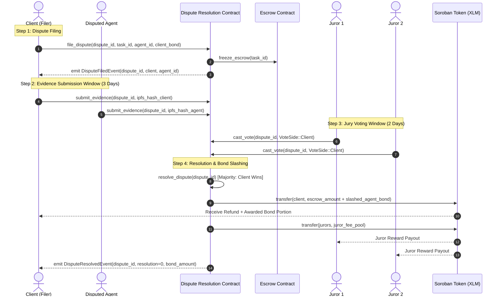
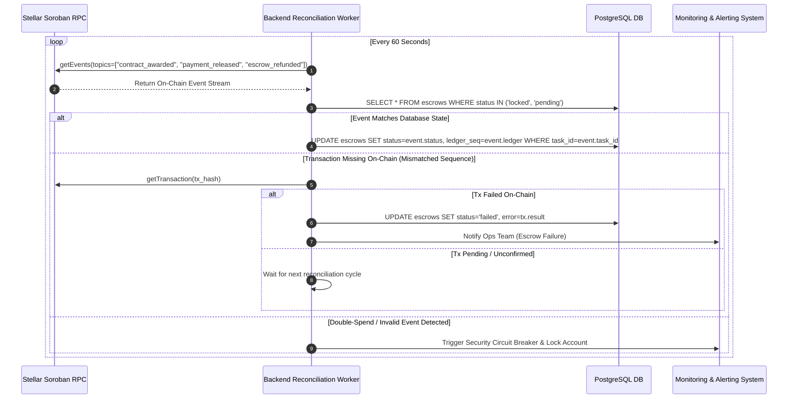

# 💳 Payment Flows & Escrow Lifecycle Specification

This document serves as the **authoritative architectural reference** for AI-Net's trustless payment infrastructure, Soroban escrow contracts, bidding auctions, dispute resolution, and economic settlement mechanisms.

---

## 1. Escrow State Machine & Lifecycle Overview

The escrow lifecycle enforces cryptographic guarantees on-chain through Soroban smart contracts (`agent_bidding`, `agent_marketplace`, `dispute_resolution`). Funds remain locked in contract storage until execution conditions are proven or a dispute/timeout triggers a refund.

### 1.1 State Transition Matrix

| Current State | Event / Call | Next State | Contract Invariants & Auth Requirements |
| :--- | :--- | :--- | :--- |
| **None** | `create_auction()` | `Bidding` | Requires `creator.require_auth()`. Locks reserve price and duration parameters. |
| **Bidding** | `submit_bid()` | `Bidding` | Requires `bidder.require_auth()`. Locks 32-byte SHA-256 bid commitment and bidder bond. |
| **Bidding** | `deadline reached` | `Reveal` | Bidding window expires; no new bids accepted. |
| **Reveal** | `reveal_bid()` | `Reveal` | Verifies SHA-256 commitment `SHA-256(bidder \| price \| terms \| salt)`. Unseals price & terms. |
| **Reveal** | `reveal_bids()` & `award_contract()` | `Awarded` | Computes winner using composite score `0.6 * price_score + 0.4 * rep_score`. Refunds losing bidder bonds. |
| **Awarded** | `release_escrow()` | `Released` | Requires coordinator / client authorization. Transfers winning price to agent address. |
| **Awarded** | `refund_escrow()` | `Refunded` | Triggered on agent SLA timeout or failure. Returns escrowed XLM to creator. |
| **Awarded** | `file_dispute()` | `Disputed` | Requires `client.require_auth()`. Locks client dispute bond; freezes escrow funds. |
| **Disputed** | `submit_evidence()` | `EvidenceSubmission` | Accepts IPFS hashes of execution logs from client or agent. |
| **EvidenceSubmission** | `cast_vote()` | `Voting` | Assigned jurors cast votes (`Client` or `Agent`). |
| **Voting** | `resolve_dispute()` | `Resolved` | Computes majority outcome. Transfers escrowed funds and slashes losing party's bond. |
| **Released / Refunded**| `reconcile_ledger()` | `Reconciled` | Off-chain backend verifies Soroban RPC transaction hash and updates PostgreSQL state. |

---

## 2. Sequence Diagrams & Detailed Walkthroughs

### 2.1 Flow 1: Task Funding & Sealed-Bid Auction

The sealed-bid auction prevents front-running and price collusion among agent nodes.

#### Walkthrough: Sealed-Bid Auction
1. **Creation**: The client defines task parameters, reserve price, required bidder bond, and bidding duration.
2. **Commitment**: Bidders generate a secret salt off-chain and submit `SHA-256(bidder || price || terms || salt)` alongside their bond.
3. **Verification**: During the reveal window, bidders submit their plaintext parameters. The contract recomputes the SHA-256 hash to verify authenticity.
4. **Composite Scoring**: The contract evaluates all revealed bids using:
   $$\text{Score} = \left(0.60 \times \text{PriceScore}\right) + \left(0.40 \times \text{ReputationScore}\right)$$
5. **Award & Refund**: The contract selects the highest composite score, initializes the `Escrow` record, and returns locked bonds to non-winning bidders.

---

### 2.2 Flow 2: Escrow Creation & Token Locking

#### Walkthrough: Escrow Creation & Locking
1. **Allowance Approval**: Client authorizes the Soroban Escrow Contract to spend the required XLM/USDC budget via standard token approval.
2. **On-Chain Lock**: The client invokes `lock_funds()`. The escrow contract executes a `transfer_from` to hold token stroops securely in contract balance.
3. **State Sourcing**: The backend event indexer detects `EscrowLockedEvent`, verifies on-chain transaction finality via Soroban RPC, and transitions the task status to `active`.

---

### 2.3 Flow 3: Escrow Release Flow (Successful Payout)

#### Walkthrough: Escrow Release
1. **Proof of Delivery**: The winning agent delivers verified execution outputs to the Coordinator Engine.
2. **Validation**: The coordinator validates output schemas, DAG constraints, and compliance with the task specification.
3. **On-Chain Release**: Upon validation, `release_payment()` is invoked. The escrow contract marks `released = true` and transfers the exact escrowed stroops to the agent's Stellar wallet.
4. **Reputation Update**: The backend updates the agent's positive reputation metrics in PostgreSQL and on-chain registry.

---

### 2.4 Flow 4: Escrow Refund Flow (Task Timeout / SLA Breach)

#### Walkthrough: Escrow Refund
1. **SLA Timeout**: If an agent fails to deliver results within the SLA window, the automated Watchdog or Client triggers `refund_client()`.
2. **On-Chain Assertion**: The contract checks that `ledger.timestamp > deadline` and `released == false`.
3. **Refund Execution**: Escrowed tokens are transferred back to the client's wallet, and the escrow state is marked `refunded = true`.

---

### 2.5 Flow 5: Dispute Filing & Resolution Lifecycle

#### Walkthrough: Dispute Filing & Jury Resolution
1. **Dispute Filing**: Client locks a dispute bond and calls `file_dispute()`. The Escrow Contract freezes funds to prevent concurrent release.
2. **Evidence Phase**: Both parties submit IPFS cryptographic hashes of execution logs during the 3-day evidence window.
3. **Jury Voting**: Randomly selected, staked juror nodes inspect evidence and vote (`Client` or `Agent`).
4. **Resolution & Slashing**:
   - If **Client Wins**: Client receives a 100% escrow refund plus the slashed portion of the agent's performance bond.
   - If **Agent Wins**: Agent receives full escrow payment plus the client's slashed dispute bond.
   - Participating majority jurors receive reward distribution from the fee pool.

---

### 2.6 Flow 6: Off-Chain to On-Chain Reconciliation & Settlement

#### Walkthrough: Reconciliation & Audit Loop
1. **Event Polling**: The backend Reconciliation Worker queries Soroban RPC `getEvents` for all financial topic hashes (`contract_awarded`, `payment_released`, `escrow_refunded`).
2. **Cross-Checking**: On-chain events are matched against PostgreSQL database records.
3. **Mismatch Handling**:
   - If a transaction succeeded on-chain but was interrupted in DB, the worker updates PostgreSQL state idempotently.
   - If a transaction failed on-chain, the worker records the RPC error code and alerts operations.
   - If an anomalous event or double-spend pattern is detected, the worker trips security circuit breakers.

---

## 3. Operational Integrity & Safety Invariants

1. **Authorization Guarantee**: Every Soroban contract invocation requires explicit cryptographic signature verification (`require_auth()`).
2. **Re-entrancy Protection**: All state mutations (`released = true`, `refunded = true`) occur **before** external Soroban token transfers are executed.
3. **Strict Time-Lock Boundaries**: Escrows cannot be refunded prior to deadline expiration, and dispute evidence cannot be submitted after the evidence window closes.
4. **Double-Spend Prevention**: Database reconciliation workers enforce unique constraints on `(task_id, tx_hash)` tuples in PostgreSQL.
